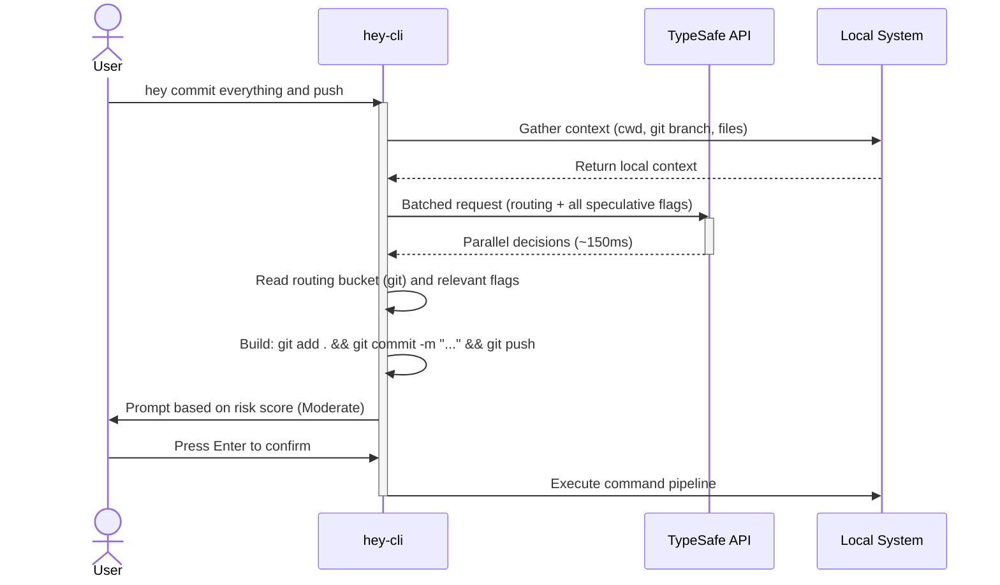

# hey-cli

A natural language to shell command interface built on TypeSafe AI.

## Architecture: System One vs. Generative LLMs

Standard LLMs incur high latency (2-5 seconds) and risk hallucinating invalid command flags due to their token-by-token generation architecture. 

`hey-cli` circumvents this by using TypeSafe AI's Jev model, a decision engine. Instead of generating text, it maps natural language queries to a deterministic command tree using probabilistic classification. 

By batching all routing, sub-command, and flag questions into a single speculative fan-out API call, the entire resolution pipeline completes in ~150ms.

## Resolution Pipeline



## Installation

```bash
git clone https://github.com/sinsniwal/hey-cli-2.0.git
cd hey-cli-2.0
pip install -e .

# Export your API key in ~/.zshrc or ~/.bashrc
export TYPESAFE_API_KEY="your_api_key_here"
```

## Usage

Prefix your natural language intent with `hey`. No quotes are required.

```bash
hey push to main
hey find all python files
hey stop all docker containers
hey commit everything and push
```

### Execution Risk Tiers

Commands are statically scored for destructive risk prior to execution:
- **Risk < 1.0 (Safe)**: Executes automatically (e.g., `git log`, `ls`, `find`).
- **Risk 1.0 - 1.9 (Moderate)**: Halts for `[Y/n]` confirmation. Pressing Enter executes (e.g., `git push`, `mv`).
- **Risk >= 2.0 (Dangerous)**: Halts and requires explicit typing of `yes` (e.g., `rm -rf`, `git push --force`).

## Supported Toolkits

- **Version Control**: git
- **Containers**: docker, docker-compose
- **Package Managers**: npm, yarn, pnpm, pip
- **File Operations**: cp, mv, rm, mkdir, chmod, ls, cat
- **Search & Processing**: grep, find, sed, awk
- **System**: ps, kill, df, du, env
- **Network**: curl, wget, ssh, ping, lsof
- **Archives**: tar, zip, gzip

## Project Status & Contributing

This project currently serves as a "Proof of Life" — it demonstrates that a low-latency, deterministic AI approach to CLI assistance is viable. 

While the tool is useful in its current state, it is actively open to evolution. I am open to Pull Requests (PRs), architectural pivots, and general community feedback. If you have ideas for extending the command tree, adding configuration files, or supporting new toolkits, please feel free to open an issue or submit a PR.
